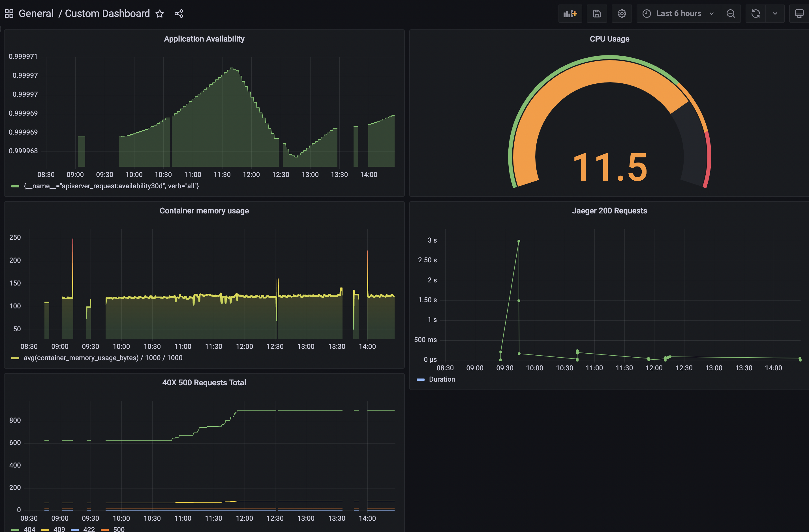

**Note:** For the screenshots, you can store all of your answer images in the `answer-img` directory.

## Verify the monitoring installation

*TODO:* run `kubectl` command to show the running pods and services for all components. Take a screenshot of the output and include it here to verify the installation.
Added pods_screenshot.png and services_screenshot.png files.

## Setup the Jaeger and Prometheus source
*TODO:* Expose Grafana to the internet and then setup Prometheus as a data source. Provide a screenshot of the home page after logging into Grafana.
Added grafana_prometheus_source.png and grafana_jaeger_source.png 

## Create a Basic Dashboard
*TODO:* Create a dashboard in Grafana that shows Prometheus as a source. Take a screenshot and include it here.
Added prometheus_dashboard.png file.

## Describe SLO/SLI
SLO - The end goal of a standard level of performance in a measurable period of time such as 99.5% server uptime in a month, 
less than 100ms per request response time
SLI - Measure the performance of the application by checking number of errors that caused application restart. 
Record duration of the request processed by the service 

## Creating SLI metrics.
* Response time
* Availability
* Error Rate
* Latency 
* Throughput

## Create a Dashboard to measure our SLIs
*TODO:* Create a dashboard to measure the uptime of the frontend and backend services We will also want to measure to measure 40x and 50x errors. Create a dashboard that show these values over a 24 hour period and take a screenshot.

## Tracing our Flask App
*TODO:*  We will create a Jaeger span to measure the processes on the backend. Once you fill in the span, provide a screenshot of it here. Also provide a (screenshot) sample Python file containing a trace and span code used to perform Jaeger traces on the backend service.

## Jaeger in Dashboards
*TODO:* Now that the trace is running, let's add the metric to our current Grafana dashboard. Once this is completed, provide a screenshot of it here.

## Report Error
*TODO:* Using the template below, write a trouble ticket for the developers, to explain the errors that you are seeing (400, 500, latency) and to let them know the file that is causing the issue also include a screenshot of the tracer span to demonstrate how we can user a tracer to locate errors easily.

TROUBLE TICKET 1

Name: Got 500 while trying to hit /trace

Date: 19th December 2022

Subject: Trial service api /trace showing internal error 500

Affected Area: Trial service

Severity: High severity

Description: Accessing /trace api in trial service get 500 error.

TROUBLE TICKET 2

Name: Got 500 while trying to hit /star

Date: 19th December 2022

Subject: Backend service api /star showing internal error 500

Affected Area: Backend service

Severity: Medium severity

Description: Accessing /star api in backend service get 500 error.

## Creating SLIs and SLOs
*TODO:* We want to create an SLO guaranteeing that our application has a 99.95% uptime per month. Name four SLIs that you would use to measure the success of this SLO.
1. Resource consumption - CPU and memory usage
2. Service availability - Backend/Frontend availability
3. Response error occurrence - HTTP 4xx and 5xx status code
4. Service response - Number of request and Response time

## Building KPIs for our plan
*TODO*: Now that we have our SLIs and SLOs, create a list of 2-3 KPIs to accurately measure these metrics as well as a description of why those KPIs were chosen. We will make a dashboard for this, but first write them down here.

Server CPU and memory usage,ensure sufficient resources is provided to the application to minimize potential issue.

1. Server CPU usage
2. Server Memory Usage

Measure the availability of services to ensure it is accessible to the endpoints access.

1. Measure Backend Availability
2. Measure Frontend Availability

Track and measure potential non-sucessful request obtained (any status code that is not 200)

1. Measure 40X Errors
2. Measure 50X Errors

Services Request and response time averagely needed per request.

1. Total requests per minute
2. Average response time

## Final Dashboard
*TODO*: Create a Dashboard containing graphs that capture all the metrics of your KPIs and adequately representing your SLIs and SLOs. Include a screenshot of the dashboard here, and write a text description of what graphs are represented in the dashboard.  

1. The highest row of the dashboard show the total CPU usage and Memory usage from the current resources.
2. Second row left diagram shows the 40X and 50X error count over 24 hours period.
3. Second row right diagram shows Jaeger 200 Request traces data.
4. Third row shows the Application availability over 24 hours period.
